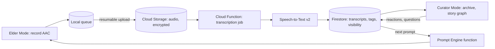

# Heirloom — the voices you can't get back

Everyone has the same regret, and they all phrase it the same way: "I wish I'd recorded her." Heirloom exists so that sentence never has to be said again. Once a week, it sends your grandfather one question — "Tell me about your first job" — and he answers by pressing one enormous button and talking. The app records his voice, transcribes it, and files it into a growing family archive where his daughter tags the people, his granddaughter discovers that he once smuggled a puppy onto a train, and forty years from now, someone who never met him hears him laugh. Heirloom is not a journaling app. It is a machine for turning grandparents into permanence, one story at a time.

## 1. Overview
- **Elevator pitch:** A two-sided family app: elders receive one thoughtful voice prompt a week and answer with a single giant record button; family members curate, tag and explore the growing archive of stories. The product compounds into a searchable, listenable oral history — and once a year, a printed book with QR-linked audio.
- **Category:** Family / Lifestyle — memory preservation.
- **Tagline:** *The voices you can't get back.*
- **Play Store positioning:** "Interview your grandparents automatically — one question a week, their voice forever."

## 2. Problem & Why Now
Every family means to do this and almost none do. The failure modes are always the same: the formal interview feels awkward, the one long session never gets scheduled, the voice memos rot unlabeled in someone's phone, and then the funeral happens. StoryCorps proved the emotional demand (700,000+ recordings); genealogy proved the market (Ancestry: 3M+ subscribers paying $100–$400/year for *documents* — Heirloom offers voices, which are categorically more precious). Why now: (1) the largest generational wealth-and-memory transfer in history is underway — Boomers are 60–80 *right now*, smartphone-equipped (grandparent smartphone adoption crossed the practical threshold during COVID video-call adoption); (2) on-device and cloud speech-to-text became effectively free and excellent, including for accented and multilingual speech; (3) families are geographically scattered, so the "sit down with a recorder" fantasy needs an asynchronous product form. The clock is the marketing: every week of delay is a week of stories lost, and the audience knows it.

## 3. Target Audience & Personas
- **Meera, 41, project manager, Toronto (the Curator).** Her father in Nagpur is 74, sharp, and full of stories nobody has captured. She buys, sets up his phone on a video call, and becomes the family admin. She pays; she invites her siblings; she cries the first time the app resurfaces his voice on his birthday.
- **Arthur, 78, retired railway engineer, Cardiff (the Elder).** Not a tech person; can manage WhatsApp voice notes. His interface is one screen: the question, a big red button, and his daughter's reaction ("Rhian listened ♥") which is the reason he keeps answering.
- **Zoe, 16, granddaughter, Bristol (the Discoverer).** Never asks Grandpa anything at dinner, but binge-listens to his war-rationing stories like a podcast, and submits her own question through the app ("what music did you dance to?"). Discoverers convert into next-generation curators — that's the 20-year retention story.

## 4. Core Concept Deep-Dive
Heirloom's central design insight is that **the interview must be dissolved into a ritual.** One question, once a week, at the elder's chosen time (Sunday after lunch is the empirically magic slot). One question is answerable; "record your life story" is paralyzing. The rhythm makes it a habit; the habit makes an archive; the archive makes a legacy.

**The Prompt Engine is the soul.** Prompts are not generic ("tell me about your childhood") but engineered keys for specific memory locks, tuned along three axes: *era* (a 1948-born elder gets questions about transistor radios and rationing, not Saturday cartoons), *culture and place* (an elder in Lucknow gets different school-day prompts than one in Ohio; launch packs for India, US/UK, and diaspora families whose answers cross borders), and *biography* (the engine reads the archive's own tags — once trains appear in three stories, it asks about the longest journey he ever took). Families can also submit questions, which jump the queue; a granddaughter's question gets answered *by name*: "Zoe asks…" — the single most powerful re-engagement event in the product.

**Two apps in one, strictly separated.** Elder Mode is a different UI universe: one screen, 28pt+ type, the question in text AND spoken aloud, a giant record button, pause, re-record, done. No feed, no settings, no navigation. It is installable standalone (a curator can set it up remotely with a code) and works on cheap Androids. Curator Mode is the rich side: the archive, tagging, the story graph, invitations, the book builder.

**The Story Graph.** Every story can be tagged with people, places, and decades. Tags interlink: tap "Uncle Dev" and hear every story he appears in, across tellers; tap "1962" and the family's year assembles itself from three voices. Two elders can receive the *same* prompt in the same week — grandma's and grandpa's versions of how they met, side by side, is the feature that gets screenshotted and shared.

**Ethics as architecture, not fine print.** The elder always owns their voice: recording begins with explicit consent captured in-flow (once, renewable), every story has an elder-controlled visibility level (family / specific people / just me / seal until a date — "open this when Zoe turns 18" is a supported, marketed feature), and everything exports at any time in open formats (MP3 + JSON + PDF transcript). Local-only storage is a real mode, not a buried toggle. Death is designed for: a Legacy Contact setting decides what happens to the archive, decided while the elder is alive.

**The emotional hook** is asymmetric reciprocity: the elder gives ten minutes; the family receives permanence. The app's job is to make the elder *feel* the reception — listen receipts as warm reactions ("Meera listened twice ♥"), never as metrics.

## 5. Complete Feature Set
**MVP (v1.0):**
- Elder Mode: weekly prompt (text + TTS), one-button recording up to 30 min, pause/resume, re-record, "send to family."
- Curator Mode: family space creation, elder remote setup via code, archive timeline, playback with transcript karaoke-highlighting, tagging (people/places/decades), family member invites (up to 15), listen-reactions.
- Prompt Engine v1: 300 hand-written prompts across era/culture packs (India, US/UK, diaspora), family-submitted questions with elder name attribution.
- Transcription (cloud, 12 languages at launch incl. Hindi, Spanish, Tamil, Urdu) with elder-dialect-tolerant model choice; searchable transcripts.
- Consent flow, per-story visibility, sealed stories, full export (MP3/JSON/PDF).
**v1.x fast-follows:**
- Story Graph explorer view; duet prompts (same question, two elders); anniversary resurfacing ("one year ago, Papa told this story"); voice-note replies from family to elder.
- Photo attach: curator adds photos to a story; elder can be asked "who is in this photo?" as a prompt type (photo-elicitation, a professional oral-history technique).
**v2.0+:**
- The Annual Book: auto-designed hardcover of the year's best stories, QR codes per story linking to audio; in-app purchase, printed and shipped.
- Multi-elder family trees with story-density visualization ("your mother's side is quiet — invite Aunt Sarla?").
- Legacy playback: memorial mode that reorganizes an archive into a life narrative.

## 6. Screen-by-Screen UX Walkthrough
Navigation: Curator Mode has a bottom bar — **Archive**, **Family**, **Prompts**, **Book**; Elder Mode has no navigation at all.
- **Elder Home (the only elder screen):** this week's question in very large type, a speaker icon that reads it aloud, the big record button, and beneath it, last week's reactions ("Meera ♥ Zoe listened"). Recording screen shows a gentle waveform and elapsed time; DONE and REDO are unambiguous giant buttons. A quiet "not this week" link skips without guilt (skips inform the prompt engine).
- **Curator Archive:** a vertical timeline of story cards (title auto-generated from transcript, duration, teller's face, play button); filter chips for teller/decade/place/person; search box hits transcripts.
- **Story Detail:** audio player with transcript highlighting as it plays; tag rail; visibility badge; comments-as-voice-notes; "ask a follow-up" button that feeds the prompt queue.
- **Family:** member list with roles (curator/listener/elder), invite flow, elder setup wizard ("Set up Papa's phone" — generates a 6-digit code, walks through a checklist including 'do this on a video call').
- **Prompts:** upcoming question preview (curators can swap it), family question submission box, pack browser.
- **Book (v2 teaser in v1):** shows the year filling up — "23 stories collected. A book needs 40." A progress meter that sells both retention and the future purchase.
**Key flow — activation (the whole business):** Meera installs → creates the Kapoor Family space → taps "Set up an elder" → chooses "he has his own phone" → gets the code + a guided video-call script → Arthur's phone becomes Elder Mode in 3 taps → Meera picks the first prompt from a "great first questions" shortlist → Sunday, Arthur records 6 minutes → Meera gets the notification, listens, reacts → Arthur sees the ♥ on Monday. Target: first story within 7 days of install for ≥40% of family spaces; this metric decides the company.
**Key flow — the granddaughter question:** Zoe (listener) hears a story mention a dance hall → taps "ask a follow-up" → types "what music did you dance to?" → next Sunday Arthur's screen says "Zoe asks:" → his answer notifies her by name.

## 7. Design Language
Warmth without kitsch: cream and archival buff surfaces, a deep bookcloth green as the primary, foil-gold accents used only for completed things (a finished story, a sealed envelope, the book). Type: a big, humane serif (Fraunces) for questions and story titles — questions should look like they came from a beautiful letter — and a plain sans for controls; Elder Mode enforces enormous sizes and WCAG AAA contrast. Motion: minimal and physical — cards settle like paper, the record button breathes slowly while armed. Sound: a soft tape-start click on record, nothing else; the product's sound is the family's voices. Iconography: line-drawn, letterpress-flavored. The whole app should feel like a well-made keepsake box, because that is literally what it is.

## 8. Technical Architecture
Opinionated stack: **Kotlin + Jetpack Compose**, single APK with Elder Mode as a launch-time profile (separate launcher activity + code-based pairing), because maintaining two apps doubles solo-dev cost for zero user benefit. Audio: record AAC locally first (never lose a story to connectivity — uploads are resumable WorkManager jobs). Backend: **Firebase** (Auth with phone-number sign-in for elders — no passwords ever; Firestore for metadata; Cloud Storage for audio; Functions for transcription orchestration). Transcription: **Google Cloud Speech-to-Text v2** with language auto-detect per elder profile; transcripts editable by curators (corrections improve search, stored as revisions). TTS for reading prompts aloud: on-device where quality suffices, cloud voice for languages that need it. Privacy architecture: per-family encryption keys for audio at rest (envelope encryption; "local-only family" mode keeps audio on devices with curator-managed backup export); no training on user audio, stated plainly.

## 9. Data Model
- **FamilySpace:** `id`, `name`, `plan{free|heirloom}`, `region_pack`, `storage_mode{cloud|local}`, `created_at`.
- **Member:** `id`, `family_id`, `role{elder|curator|listener}`, `name`, `phone/auth_id`, `elder_profile?{birth_year, birthplace, languages[], prompt_prefs, legacy_contact_id}`.
- **Prompt:** `id`, `text`, `tts_ref`, `pack`, `era_range`, `culture_tags[]`, `type{standard|family_question|photo|duet}`, `submitted_by?`.
- **Story:** `id`, `family_id`, `elder_id`, `prompt_id`, `audio_ref`, `duration_s`, `transcript_rev_refs[]`, `title_auto`, `visibility{family|listed_members|private|sealed{date}}`, `consent_ref`, `recorded_at`.
- **Tag:** `id`, `family_id`, `type{person|place|decade}`, `label`, `story_ids[]`.
- **Reaction:** `story_id`, `member_id`, `kind{heart|listened}`, `at`.
- **BookOrder (v2):** `family_id`, `year`, `story_ids[]`, `status`, `shipping`.

## 10. Monetization
Family-plan subscription, priced against what it replaces (a $400 StoryWorth-style year, a $300 Ancestry year). **Free:** one elder, 10 stories, 3 members, full consent/export rights (exports are never paywalled — holding memories hostage would be both evil and a press disaster). **Heirloom Family — $7.99/month or $59.99/year** (₹499/yr tier for India-billed families; one plan covers the whole family space): unlimited elders, unlimited stories, 15 members, duet prompts, story graph, anniversary resurfacing, priority transcription. **The Annual Book: $79–$129** per copy (page-count tiered), the physical profit center with gift-season spikes. Paywall placement: story #11 ("Papa's stories are still being recorded — keep the archive growing"), second elder invite, and the Book meter. Conversion logic: the buyer (curator) is not the primary user (elder), so all upgrade pressure lands on curators, never on the elder screen — Elder Mode contains zero commerce by policy. Target: 8–12% of activated family spaces (those with a first story) converting to paid within 60 days; book attach rate 15% of paid families in year one.

## 11. Play Store Listing
- **Title (≤30):** `Heirloom: Family Stories` (24)
- **Short description (≤80):** `One question a week. Your grandparents' voices, kept forever.` (61)
- **Full description:** open with the regret sentence ("I wish I'd recorded her"); blocks: One Question a Week (the ritual), Made for Grandparents (Elder Mode, huge buttons, 12 languages), The Family Archive (search, tags, the graph), Their Voice, Their Rules (consent, sealing, export), The Annual Book. Close with the clock ("The best week to start was twenty years ago. The second best is this Sunday.").
- **ASO keywords:** record family stories, grandparents app, oral history, family memories app, voice journal for seniors, storyworth alternative, family archive, memory keeping, legacy recording, interview grandparents.
- **Content rating:** Everyone. UGC (private, family-scoped) → declare UGC with private-sharing scope; report/block within family spaces.
- **Data safety:** voice recordings + transcripts (core purpose), phone auth, no ads SDKs, no data sale, deletion on request — the form must be pristine; this app's category makes privacy claims load-bearing.

## 12. Growth & Marketing Plan
The product produces its own marketing: family spaces are multi-install by nature (1 purchase → 5–15 installs). Launch: (1) gift-season anchor — everything about launch timing aims at November–December ("this year, give them your questions"), with a giftable setup card PDF; (2) the TikTok/Reels format that already works organically — "I asked my grandpa X and recorded it" videos reliably go viral; partner with 20 family-content creators, provide the format, let the grandparents be the stars; (3) diaspora communities (Indian, Filipino, Mexican diasporas) via community newsletters and radio — the scattered-family pain is sharpest there and the multilingual transcription is the differentiator; (4) partnerships with hospice and senior-living organizations (they actively look for legacy activities; a compassionate discount program does good and seeds installs). Built-in loops: sealed stories create future re-engagement events years out; anniversary resurfacing creates annual emotional spikes that get screenshotted; every printed book is a physical advertisement on a coffee table with QR codes in it.
Retention marketing: the weekly cadence IS retention; the curator digest email ("Papa told a 9-minute story about a wedding") is the only email that matters.

## 13. Analytics & KPIs
North star: **weekly recorded stories per active family space** (target ≥ 0.7 — most elders answer most weeks). Key events: `family_created`, `elder_paired{remote|in_person}`, `first_story{days_since_install}`, `story_recorded{duration}`, `story_listened{listener_role}`, `reaction_sent`, `family_question_submitted`, `tag_added`, `sub_start`, `export_used`, `seal_created`, `book_meter_viewed`. Thresholds: activation (first story ≤ 7 days) ≥ 40% of spaces; elder week-4 answer rate ≥ 60%; ≥ 2 distinct listeners per story median; curator D30 ≥ 45%; paid conversion of activated spaces ≥ 8%; transcription word-error complaints < 2% of stories (proxy: transcript edit rate). Watch one dark metric with respect: archives that go silent because the elder passed — measure nothing there except whether the family returns to listen, and never send those families growth prompts.

## 14. Risks & Mitigations
- **Elder-side friction kills activation:** the remote-setup wizard with a video-call script is the answer; test it with real 75+ users monthly; Elder Mode ships in the lowest-end device profile (Android 8, 2GB) flawlessly.
- **Grief and death handled wrongly = brand destruction:** legacy contact + memorial mode designed with a grief counselor consult; all lifecycle emails suppressed automatically on memorial state; this is a feature spec, not an afterthought.
- **Privacy breach would be existential:** per-family envelope encryption, minimal staff access, security review before launch, local-only mode honestly implemented; publish a plain-language privacy page.
- **Transcription quality for accented/code-switching elders:** language auto-detect per profile, curator-editable transcripts, and honest marketing (voice is the product; the transcript is the index).
- **Seasonal demand spikes (books at Christmas):** print partner with proven capacity (Blurb/Peecho API), order cutoff dates communicated in-app in October.
- **Play policy:** UGC declaration, precise data-safety form, no "medical/health" claims anywhere despite the senior audience.

## 15. Competitive Landscape
- **StoryWorth (~$99/year, email + book):** the category proof; email-and-typing based, elder-hostile in practice (typing!), voice as afterthought, US-centric, no archive experience. Heirloom is voice-first, mobile-first, multilingual, and family-experiential rather than book-pipeline-only.
- **Remento ($99/year, US):** voice prompts + book with QR codes — closest competitor; premium US positioning, no Android-first strategy, no multilingual depth, no story graph. Heirloom differentiates on Android reach, diaspora languages, the two-mode architecture, and family interactivity (questions, duets, reactions).
- **StoryCorps app (free, nonprofit):** beautiful mission, session-based (in-person interviews), no ritual cadence, no family archive product. A cultural ally more than a competitor — and proof of emotional demand.
- **Ancestry/FamilySearch Memories:** genealogy giants with memory features bolted on; documents-first DNA-first cultures, elders are subjects, not users. Heirloom makes the elder the protagonist.
- **WhatsApp voice notes (the real competitor):** free, familiar, and where these stories currently go to die — unlabeled, unsearchable, undeletable-by-accident. Heirloom's pitch against it is one word: forever.

## 16. Development Plan
Solo dev, ~24 weeks to v1.0. W1–3: Elder Mode vertical slice (prompt → record → upload → curator playback) — **kill criterion:** hand it to three real 70+ testers by week 3; if any needs verbal help past the first recording, redesign before building anything else. W4–6: family spaces, roles, remote pairing wizard. W7–9: transcription pipeline, transcript player, search. W10–12: tagging, archive timeline, reactions, family questions. W13–15: Prompt Engine v1 + 300 prompts (write with a cultural consultant per pack, ~$1.5k); consent/visibility/sealing/export. W16–17: encryption + local-only mode. W18–20: closed beta with 25 real families across 3 countries; watch activation funnel obsessively. W21–22: onboarding polish, store assets, gift-card PDF, launch video (one real family, one real story). W23–24: buffer + launch (timed for early November). **If behind:** cut duet prompts, cut photo prompts, reduce launch languages to 6 — never cut the remote-setup wizard, consent flow, or export.

## 17. Moonshots
- **Voice preservation (with consent as ceremony):** an opt-in, elder-initiated voice model that lets descendants hear *new* readings — bedtime stories for great-grandchildren in Nana's voice — governed by the strictest consent flow in consumer software and released only when it can be done with dignity.
- **The Question Genome:** an open, community-built library of 10,000 culturally tuned prompts, becoming the definitive oral-history question dataset.
- **Museum mode:** partnerships where families opt to donate selected stories to national oral-history archives (with StoryCorps-style institutions) — private memories becoming public heritage.
- **Reunion Rooms:** live family listening parties with synchronized playback and recorded reactions — the archive as an event.
- **Two-generation flip:** prompts that interview the *grandchildren* about the elders while they're alive ("what do you hope you inherit from her?") — sealed until the elder's 90th birthday.
